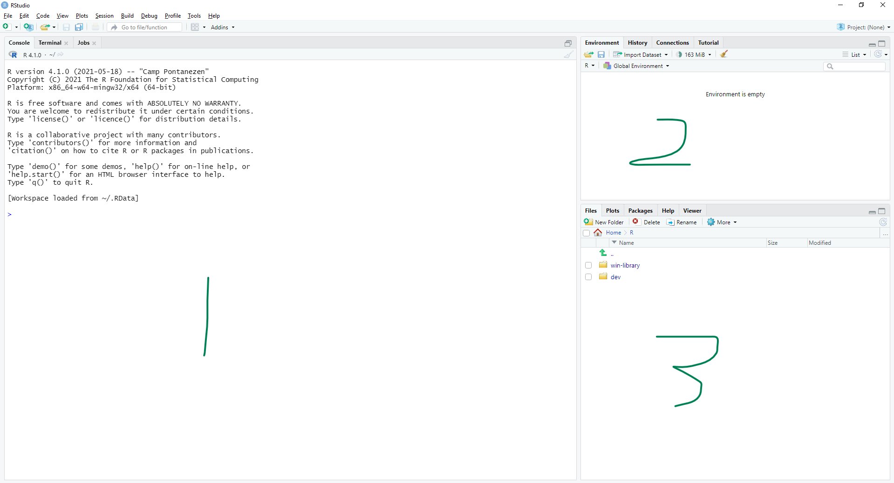
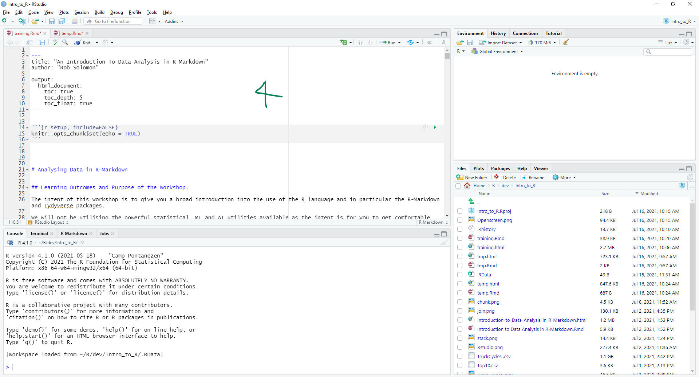
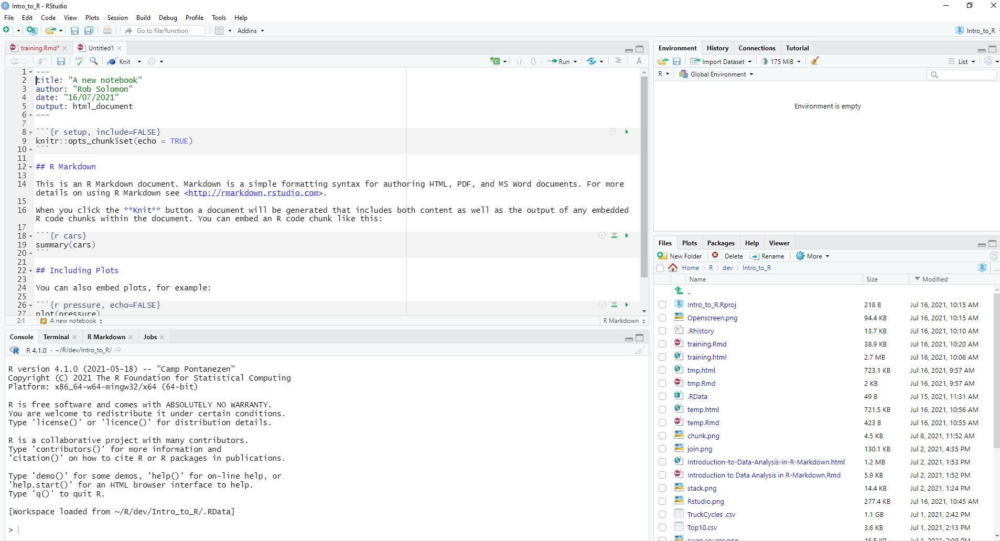
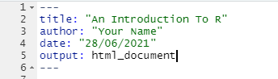
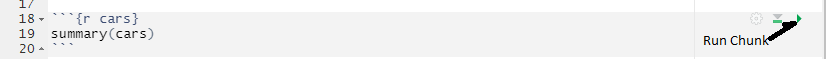
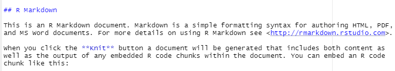
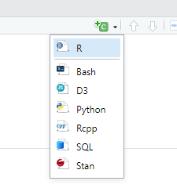

---
#https://bookdown.org/yihui/rmarkdown/html-document.html#
title: "Visualising Safety data"
author: "Rob Solomon"
date: "2023-06-30"
output: 
  html_document:
    code_folding: show
    toc: false
    toc_depth: 6
    number_sections: true
    df_print: paged

---

<style type="text/css">
.main-container {
  max-width: 1800px;
  margin-left: auto;
  margin-right: auto;
}
</style>

```{r setup, include=FALSE, message=FALSE, tidy=TRUE}
knitr::opts_chunk$set(echo = TRUE, message = FALSE,warning = FALSE)
```

# Learning Outcomes and Purpose of the Workshop {.tabset  .tabset-pills}

## Introduction

Welcome to the Mine4006 Safety data exploration workshop.

## Learning Outcomes

The intent of this workshop is to give you a broad introduction into the
use of the R language and in particular the R-Markdown and Tydyverse
packages as well as the plotting oackage ggplot2.

We will not be utilising the powerful statistical, ML and AI utilities
available as the intent is for you to get comfortable with the
environment and syntax. It is important to realise however that the R
environment has access to very powerful and up to date tools that can
easily be incorporated in your analysis.

The workshop is predicated on the idea that learning a language like R
takes time and practice. Open source packages such as R or Python
continuously develop with new packages emerging all the time. It is
virtually impossible to be across everything that exists at any one
time.

As mining/metallurgical engineers this is probably not your main goal,
however, as data sets become bigger and more complex it will be
beneficial for you to be comfortable with tools that will allow
manipulation and analysis of such data which otherwise cannot be achieved
in tools such as excel.

The learning process is based on the model that a simple way of
learning is to

-   Take some pre-existing code that achieves something similar to what
    you are trying to achieve
-   Observe and interpret the code
-   Manipulate to achieve your desired outcome.

As such I have tried to include a number of basic code snippets with
explanatory notes that you can copy and modify to meet your specific
analytical objective.

When embarking on something that you are unsure of how to proceed,
GOOGLE is your friend and <https://stackoverflow.com/> would be a great
place to start. Always remember that someone, somewhere has tried to do
a similar thing and published a technique if not a package to do it.

At the conclusion of this workshop you will be confident to develop
basic code in R and publish R-Markdown HTML documents.

## Introduction to R and Set-Up

The combination of R-Studio and R-Markdown is a very powerful
environment for analysing and publishing data. We will have a very brief
overview of the tools before we get started. Hopefully we can pick up
some additional tips along the way but there are many on-line resources
to help you when needed.

## The Technology Stack {.tabset  .tabset-pills}

### Introduction

This section presents a broad outline of the digital technology stack you will be working with today

### Base R

R is a programming language and free software environment for
statistical computing and graphics supported by the R Foundation for
Statistical Computing. The R language is widely used among statisticians
and data miners for developing statistical software and data analysis.


[Click to go to reference](https://en.wikipedia.org/wiki/R_(programming_language)){.uri}


### RStudio

RStudio is an Integrated Development Environment (IDE) for the R
programming language. It is available in two formats: RStudio Desktop is
a regular desktop application while RStudio Server runs on a remote
server and allows accessing RStudio using a web browser.The RStudio IDE
is available with the GNU Affero General Public License version 3. The
AGPL v3 is an open source license that guarantees the freedom to share
the code.

<https://www.rstudio.com/>

### R Markdown

An R-package that makes it easy for users to mix text with code of
different languages within the same environment. R is the most common
language but the platform supports Python, shell scripts, SQL, Stan,
JavaScript, CSS, Julia, C, Fortran, and other languages in the same
RMarkdown document. <https://bookdown.org/yihui/rmarkdown/>

### Tidyverse

A set of R packages for data science and visualisation, including
ggplot2, dplyr, tidyr, and purrr

<https://www.tidyverse.org/>

### A graphical Representation

A graphical representation of the environment.


# RStudio Some More Detail {.tabset  .tabset-pills}

## Introduction

This section presents a bit more detail about the RStudio IDE

## The main Panes

When R-Studio is opened the first time the layout looks something like
the image below



1)  Console Panel (Left)

2)  Environment Panel (default Top Right)

3)  Files Panel (default bottom Right)

## Open an Existing File

From the Files menu

Select Open File

navigate to ...\\Documents\\\R\\visualisation.Rmd

Select\
Introduction To Data Analysis in R-Markdown.Rmd

this will open a 4th pane in the top left of the screen



## The Structure of an R Markdown Document {.tabset  .tabset-pills}

### Introduction


Now that we know our way around R-Studio a bit, we can now create our
first R-Markdown document within our project.

To do this:- go to the File menu\
Select New File\
Enter Title: "An Introduction to RMarkdown"\
Enter Author: "Put your Name"\
Select HTML

This creates a new document with a pro-forma and some example code.



As can be seen there are a number of different regions within the
document.

### A Header Region Containing the Document Name and Author etc.



### Chunks of Code



as can be seen the code chunks are shaded.

### Finally Regions of Text and Formatting



You can publish the simple pro-forma document by pressing the knit
button on the top of the "source" panel.


You will be prompted for a file name as the file will need to be save
prior to knitting. Enter whatever name you wish the file saved as.

Once the process is complete a .html document will open up and you can
see the impact of some simple formatting and the co-mingling of code
text and graphics.

### Add Your Own Code

Go to the bottom of the file and add another chunk of code.

to add a new chunk of code by selecting the +C button at the top of the
source panel and selecting 'R' 

inside the chunk type

print("hello world")

then re-knit.

## Some Useful Links 


Base R Cheatsheet

<https://geomoer.github.io/moer-base-r/cheatsheet.html>

Central Repository of an array of useful cheat sheets

<https://www.rstudio.com/resources/cheatsheets/>


# Conducting Analysis of Safety Data {.tabset  .tabset-pills}

## Initial Loading and Opening of Libraries {.tabset  .tabset-pills}

### Introduction

In this section we will conduct the initial data import as well as do some basic data wrangling

### Installing and Opening Libraries

```{r}
# Install readxl R package - do this only once
#install.packages("readxl")

# open libraries
library(readxl)
library(tidyverse)
library(data.table)
library(ggplot2)
```


### Get the Data

```{r warning = FALSE,error=FALSE}

safety_data <- read_excel("safety data - Dr Apurna Ghosh.xlsx")
```

### Basic Data Wrangling

Read the Convert text format to date format and create two new columns using mutate.

```{r}
safety_data <- safety_data %>%
mutate(
Date = as.Date(Date, "%d/%m/%Y"),
month = month(Date),
year = year(Date)
)
```

### Quick Check on Numbers

```{r}

#
# quick look to see if employee numbers are unique
#

multiple <- safety_data %>%
  group_by(EmployeeID) %>%
  summarise(n = n()) %>%
  filter(n > 1)

print(paste0("There are ",nrow(multiple)," EmployeeID's with multiple events"))


```

## Simple Visualisation {.tabset  .tabset-pills}

### Introduction

In this section we will introduce the powerful graphics package ggplot and give some helpful code snippets.

### Introduction - a Basic Chart {.tabset  .tabset-pills}

#### Introduction - A Basic Run Chart

In this section we will introduce a simple run chart and give some examples of how to modify the look of the chart

#### Data Wrangling

Wrangle the data
Create a new column of month start dates using as.Date() and paste0() functions
group the data in groups of months based on month_start column
produce a new column n_events containing the total number of events using n().
other common summarising functions are mean(x , na.rm=TRUE/FALSE), sd(x , na.rm=TRUE/FALSE) -Standard deviation, max(x , na.rm=TRUE/FALSE),
min(x , na.rm=TRUE/FALSE),quantile(x,prob=0.9)

```{r}


safety_data <- safety_data %>% 
  mutate(month_start=as.Date(paste0(year,"-",month,"-",01)))
trend <- safety_data %>% 
  group_by(month_start) %>% 
  summarise(n_events=n()) 
```


```{r}
# create a basic plot variable using ggplot
p <- trend %>% ggplot(aes(x=month_start,y=n_events))+
  geom_point()
# Display it
plot(p)
```

#### Add titles

Improve the chart with some labels
Introducing "labs" functoin to the ggplot

```{r}
# 
p <- p +
  labs(title = "Trend of Monthly Events",
       subtitle = "all events",
       x="Date",
       y="Number of Events")
plot(p)
```

#### Add a Trend line

Introducing the "smooth" function to add a trend line

```{r}

p1 <- p+
  geom_smooth()
plot(p1)

```

#### Change Degree of smoothing - Little Smoothing

Introducing "span" parameter to the geom_smooth() function. Span ranges between zero and one, a number close to zero results in little smoothing and a number close to one gives a great deal of smoothing.


```{r}
# you can alter the degree of smoothing using the span parameter
p1 <- p+
  geom_smooth(span=.08)
plot(p1)
```

#### Change Degree of smoothing - Lottle Smoothing

Introducing "span" parameter to the geom_smooth() function. Span ranges between zero and one, a number close to zero results in little smoothing and a number close to one gives a great deal of smoothing.


```{r}
# you can alter the degree of smoothing using the span parameter
p1 <- p+
  geom_smooth(span=.8)
plot(p1)
```

#### Some Comments on Default Smoothing Function

The default smoothing function is a centralised estimate of the current value.  This means that it uses both backwards and forwards look ahead.

The advantage of this technique is that the smoothed trend does not lag the current performance as would a moving average based on historic data.  The disadvantage is that at the end of the graph, the available data to produce a centralised estimate reduces and estimate error increases.

#### More Aesthetic changes to charts {.tabset  .tabset-pills}

##### Change Colour of Line

Introducing the colour parameter to the geom

```{r}

p1 <- p+
  geom_smooth(span=.08,colour="red")
plot(p1)
```


##### Remove Error Region

introducing the se parameter to the geom_smooth() function. The name se is an acronym for "Standard Error" and is set at either TRUE or FALSE

```{r}

p1 <- p+
  geom_smooth(span=.08,colour="red",se=FALSE)
plot(p1)
```


##### Change the Colour and Intensity of Shading -Near Opaque

Introducing the fill parameter as well as the alpha parameter to the geom.
Alpha ranges between zero ( transperant ) to one (full opaque)

```{r}
# Change the colour and intensity of shading
p1 <- p+
  geom_smooth(span=.08,colour="red",fill="red",alpha=0.9)
plot(p1)
```


##### Change the Colour and Intensity of Shading -Near transperant

```{r}
p1 <- p+
  geom_smooth(span=.08,colour="red",fill="red",alpha=0.1)
plot(p1)
```

## Team Task {.tabset  .tabset-pills}

### Introduction

In this section we will discuss the use of Rolling Averages as well as how to calculate them in R.


### A Group Activity

You are sitting in the monthly safety meeting and the safety manager presents the following chart.

Team Activity 

What should your response be?


```{r}
mma <- read.csv("3mma.csv") %>% 
  mutate(Date=as.Date(Date,"%Y/%m/%d"))

intervention <- mma$Date[13]
response <- mma$Date[nrow(mma)-1]
arrow <- data.frame(x=c(intervention,mma$Date[23]),y=c(mma$Trend[13],mma$Trend[23]))
p <- mma %>% ggplot(aes(x = Date, y = Trend)) +
  geom_line() +
  geom_point() +
  geom_segment(
    aes(
      x = intervention,
      y = mma$Trend[13],
      xend = mma$Date[22],
      yend = (mma$Trend[22] + mma$Trend[23]) / 2
    ),
    arrow = arrow(length = unit(0.5, "cm")),
    colour = "green"
  ) +
    geom_segment(
    aes(
      x = mma$Date[22],
      y = (mma$Trend[22] + mma$Trend[23]) / 2,
      xend = mma$Date[31],
      yend = (mma$Trend[22] + mma$Trend[23]) / 2
    ),
    arrow = arrow(length = unit(0.5, "cm")),
    colour = "blue"
  ) +
    geom_segment(
    aes(
      x = mma$Date[31],
      y = (mma$Trend[22] + mma$Trend[23]) / 2,
      xend = mma$Date[34],
      yend = mma$Trend[34]
    ),
    arrow = arrow(length = unit(0.5, "cm")),
    colour = "red"
  ) +
  annotate(
    "text",
    label = "Implementation \nof Improvement",
    x = intervention,
    y = 2,
    angle = 90
  ) +
  annotate(
    "text",
    label = "Are we loosing\nthe benefit?",
    x = response,
    y = 1,
    angle = 90
  ) +
  labs(title = "Trend in LTIFR",
       y = "LTIFR",
       subtitle = "3MMA") +
  lims(y = c(0, 5))


p
```


### Pros and Cons

Rolling averages are commonly used in industry as a way of smoothing a trend in data.  It is a relatively simple technique to apply and the algorithm easily understood.

It is worth understanding some of the limitations however.

Firstly.  The trend line will always lag the real data (you can calculate centralised moving averages but this is rarely done in application and it fails to produce a current result.)
Secondly.  Rolling averages can result is spurious understanding of the recent trend.  This is a result of there being  two values that impact the change from the penultimate point to the latest point.  That is, the new number entering the moving average calculation for the last point and the value exiting.

If the last point shows a step increase from the previous point this could be because the last point is in fact higher than the previous points or because an low point has exited.  As there is no greater weight given to the last or the first point one must look more closely to understand what has happened.

Traditional moving averages have limited statistical significance.  Using the geom_smooth() trend line and the Standard Error band will be more statistically valid, but as I have found, more difficult to sell in an organisation.

### Answering the question {.tabset  .tabset-pills}

#### Introduction

It is not always easy to interpret what at face value seems a simple chart, but it is a good practice to at least dig into the data a bit more.

#### Look more closely at the data

To answer the above question it is worthwhile looking more closely at the underlying data.


```{r}
p <- mma %>% ggplot(aes(x=Date,y=Trend))+
  geom_line()+
  geom_line(aes(y=Data),colour="red",linetype=3)+
  geom_point(aes(y=Data),colour="red")+
  annotate("text",label ="Implementation of Improvement",x=intervention,y=2,angle=90)+
  annotate("text",label ="Are we loosing\nthe benefit?",x=response,y=1,angle=90)+
  labs(title = "Trend in LTIFR",y="LTIFR",subtitle = "Black = 3MMA,  Red = Monthly Data")+
  lims(y=c(0,5))
 


p
```

As can be seen the problem appears to be a significant spike in April 2023, interestingly because of the lagging effect of the 3MMA the April 23 report would possibly not have highlighted the issue.

In May and June the data was trending down but the smoothing function was trending up (as Feb and March which were lower than the trend were moving out of the calculations)

#### Does the Smoothing Function give a Better Response

```{r}
p <- mma %>% ggplot(aes(x=Date,y=Trend))+
  geom_line()+
  geom_line(aes(y=Data),colour="red",linetype=3)+
  geom_smooth(fill="blue",alpha=0.2)+
  geom_point(aes(y=Data),colour="red")+
  annotate("text",label ="Are we loosing\nthe benefit?",x=response,y=1,angle=90)+
  annotate("text",label ="Implementation of Improvement",x=intervention,y=2,angle=90)+
  labs(title = "Trend in LTIFR",y="LTIFR",subtitle = "Black = 3MMA,  Red = Monthly Data, blue= central local polynomial")+
  lims(y=c(0,5))


p
```

To some extent but it still shows an upward trend.

#### Statistical Process Control

The real solution is to use a Process Control Chart and understand that the April result was a special cause, highligt it and remove it from the smoothing calculation.

The use of statistical process control is an important topic but we will not cover it in this workshop.


## Traditional 3 Moving Average {.tabset  .tabset-pills}

### Introduction

In this section we introduce the code to produce a rolling average and compare it with the geom_smooth() function. 

### Code

introducing the library zoo and it's function rollmean()

```{r}

library(zoo)
trend1 <- trend %>%
  mutate(moving_average = rollmean(n_events, k = 3, fill = NA,align = ("right"))) %>% 
  filter(!is.na(moving_average)) %>% 
  filter(!is.na(month_start))
```

### Basic Chart

```{r}
p <- trend1 %>% ggplot() +
  geom_point(aes(x = month_start, y = n_events))+
  geom_line(aes(x = month_start, y = moving_average),colour = "red")+
  labs(title = "3 month moving average of incidents",x="date",y="Incidents")


p
```

### Adding geom_smooth()

```{r}
p <- trend1 %>% ggplot() +
  geom_point(aes(x = month_start, y = n_events))+
  geom_smooth(aes(x = month_start, y = n_events),span=0.08)+
  geom_line(aes(x = month_start, y = moving_average),colour = "red")+
  labs(title = "3 month moving average of incidents",x="date",y="Incidents")


p
```

### 12 Month Moving AVerage

```{r}
# This is a great visualisation method as the trend is a central estimate, many trending processes such as 
# rolling averages tend to lag the data lets add a typical 12 month rolling mean to the plot.
# to do this we need to create an additional column and install the "zoo" package for rolling statistics
#install.packages("zoo")

# lets now add a 3 month moving average to the data
library(zoo)
trend1 <- trend %>%
  mutate(moving_average = rollmean(n_events, k = 12, fill = NA,align = ("right"))) %>% 
  filter(!is.na(moving_average)) %>% 
  filter(!is.na(month_start))


p <- trend1 %>% ggplot() +
  geom_point(aes(x = month_start, y = n_events))+
  geom_smooth(aes(x = month_start, y = n_events),span=0.18)+
  geom_line(aes(x = month_start, y = moving_average),colour = "red")+
  labs(title = "3 month moving average of incidents",x="date",y="Incidents")


p
```

## Multiple lines on the same chart {.tabset  .tabset-pills}

### Introduction

In this section we introduce the ability to group data into different lines on the chart within the aesthetic() function  using the parameters colour and fill.

The colour parameter defines the colour of the line or the edge of the marker whilst fill defines the fill of the area or marker.

Note.  It is important to incorporate the fill and colour in the aesthetic function.  If you place it outside as an independant parameter to ggplot it simply defines the colour of the plotr rather than grouping into different lines.

Other aesthetic parameters that can achieve a similar splitting are 'alpha', 'linetype' and 'linewidth'

### Raw Chart

```{r}
# now plot multiple views on the same chart 
trend <- safety_data %>% 
  mutate(month_start=as.Date(paste0(year,"-",month,"-",01))) %>% 
  group_by(month_start,FullOrPartTime,Gender) %>% 
  summarise(n_events=n()) 
p <- trend %>% 
  ggplot(aes(x=month_start,y=n_events,colour=FullOrPartTime,linetype=Gender))+
  geom_line()
p <- p +
  labs(title = "Trend of Monthly Events",
       subtitle = "all events",
       x="Date",
       y="Number of Events")

print(p)

```

Interestingly this chart has shown up some anomolies in the data so we need to do a bit more cleaning.  This is not uncommon in data analysis of large data sets that during the analysis we find data anomolies that mean we need to refresh out understanding of the data.

### Removing the problematic rows.

```{r}
t <- safety_data %>% 
  mutate(Gender=ifelse(Gender =="M",'Male',Gender)) %>% 
  filter(FullOrPartTime == 'Full-Time' | FullOrPartTime =='Part-Time') %>% 
  filter(Gender == 'Male' | Gender == 'Female')
```

```{r}
# now plot multiple views on the same chart 
trend <- t %>% 
  mutate(month_start=as.Date(paste0(year,"-",month,"-",01))) %>% 
  group_by(month_start,FullOrPartTime,Gender) %>% 
  summarise(n_events=n()) 
p <- trend %>% 
  ggplot(aes(x=month_start,y=n_events,colour=FullOrPartTime,linetype=Gender))+
  geom_line()
p <- p +
  labs(title = "Trend of Monthly Events",
       subtitle = "All events",
       x="Date",
       y="Number of Events")

print(p)

```


### Adding trend lines

```{r}

p1 <- p +
  geom_smooth()
print(p1)
```


## A More Complex Example {.tabset  .tabset-pills}

Produce a series of plots on the trends of the top 10 body part locations

### Data Wrangling

```{r}
# First create a data frame containing a list of body parts and frequency of incidents
# using group and summarise.
# Arrange in decreasing order
# and take a slice of the top 10
top_10_body_parts <- safety_data %>% 
  mutate(BodyPart=as.character(BodyPart)) %>% 
  group_by(BodyPart) %>% 
  summarise(n=n()) %>% 
  arrange(-n) %>% 
  slice(1:10)

# Now right join this with the original safety data set to obtain a data from containing 
# all the data for the to 10 body part locations

top_10_body_part_data <- right_join(safety_data,top_10_body_parts)
# now generate the monthly data for each data set
top_10_body_part_trend <- top_10_body_part_data %>% 
  group_by(month_start,BodyPart) %>% 
  summarise(n_events=n())
```

### Output from Wrangling

```{r}

top_10_body_part_trend

```
### Graphical Output {.tabset  .tabset-pills}


#### Graphical Output

These charts are obviously very difficult to interpret as there are so many lines on the chart.  WE can simply fix this with the function facetwrap()

```{r}
p <- top_10_body_part_trend %>% ggplot(aes(x=month_start,y=n_events,colour=BodyPart,fill=BodyPart))+
  geom_line()
p <- p +
  labs(title = "Trend of Monthly Events",
       subtitle = "Grouped by body part",
       x="Date",
       y="Number of Events")
print(p)
```


#### Using facet_wrap() to Simplify the Charts

Introducing facet_wrap() as an easy way of producing multiple charts by splitting the data by a variable say body part.

If we wanted to split by BodyPart and by Gender we could use a similar process with the function facet_grid()


```{r}
p <- top_10_body_part_trend %>% 
  ggplot(aes(x=month_start,y=n_events,colour=BodyPart)) +
  geom_point() +
  facet_wrap(facets = vars(BodyPart))
print(p)

```

#### with a trend

```{r}

p <- top_10_body_part_trend %>% 
  ggplot(aes(x=month_start,y=n_events,colour=BodyPart)) +
  geom_point() +
  geom_smooth() +
  facet_wrap(facets = vars(BodyPart),scales = "fixed")
print(p)
```

## Pareto Charts {.tabset  .tabset-pills} 

### Introduction

A Pareto Chart is a very powerful tool for showing the relative importance of problems. It contains bars where individual values are represented in descending order by bars.

### An Initial Attempt

There are two problems with this chart the first being that the axis labels are unreadable and the second is that the sequence of factors on the x axis is not right.


```{r}
## Pareto
p <- top_10_body_parts %>% ggplot(aes(x=BodyPart,y=n,fill=BodyPart))+
  geom_col(alpha=0.7)
print(p)
```

### Fixing the axis labels

This is easily achieved using the theme() function and defining the element_text() parameter to an angle of 90 degrees.

```{r}
p <- p+
  theme(axis.text.x = element_text(
    # rotates the x axis labels
    angle = 90,
    hjust = 1,
    vjust = 0.5
  )) 
print(p)
```

### Fixing the order

Unfortunately simply plotting the bar chart using geom_col() results in the x axis being ordered in alphabetical order rather than in the order in which the data frame is sorted.  This is because the default order of factors in R is alphabetical.

We need to specifically define the order of the factors using the factor function and specifically defining the order.

```{r}
top_10_body_parts$BodyPart <-
  factor(top_10_body_parts$BodyPart ,
         levels = top_10_body_parts$BodyPart[order(-top_10_body_parts$n)])

p <- top_10_body_parts %>% ggplot(aes(x=BodyPart,y=n,fill=BodyPart))+
  geom_col(alpha=0.7) +
  theme(axis.text.x = element_text(
    # rotates the x axis labels
    angle = 90,
    hjust = 1,
    vjust = 0.5
  )) 
print(p)
```


### Using facet_wrap to produce a series of charts by year

Noting that the sequence of factors is constant and arranged by the overall rank over the full period. As such in any one year (say 2010) the chart is not a true Pareto chart 

```{r}
top_10_body_part_annual_trend <- top_10_body_part_data %>% 
  group_by(year,BodyPart) %>% 
  summarise(n_events=n()) 

top_10_body_part_annual_trend$BodyPart <-
  factor(top_10_body_part_annual_trend$BodyPart ,
         levels = top_10_body_parts$BodyPart[order(-top_10_body_parts$n)])

p <- top_10_body_part_annual_trend %>%
  ggplot(aes(x = BodyPart, y = n_events, fill = BodyPart)) +
  geom_col(alpha = 1) +
  theme(legend.position = "none",
        axis.text.x = element_text(
          # rotates the x axis labels
          angle = 90,
          hjust = 1,
          vjust = 0.5
        )) +
  facet_wrap(facets = vars(year))
p

```

## Pie Charts


```{r}

library(scales)
tot_events <- sum(top_10_body_parts$n)
top_10_body_parts$frac <- top_10_body_parts$n/tot_events
p <- top_10_body_parts %>%
  ggplot(aes(x = "", y = frac,fill=BodyPart)) +
  geom_col(alpha=0.5)+
   geom_text(aes(label = paste(round(frac*100,1),"%")),
            position = position_stack(vjust = .5),
            size=3,
            angle=45
            )+
  coord_polar("y", start=0)+
  theme_void()

p
```

